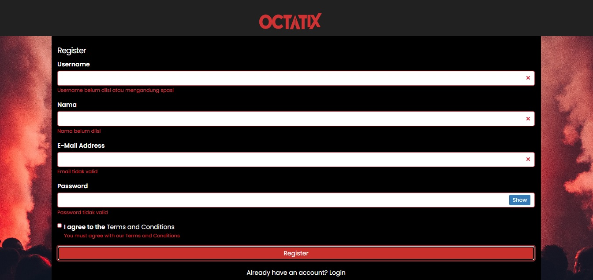
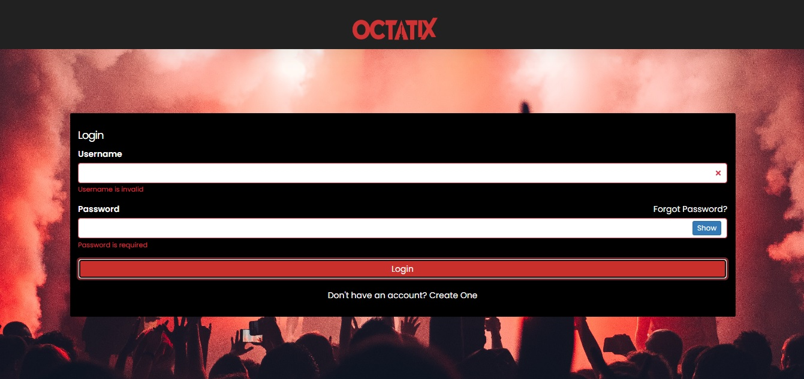
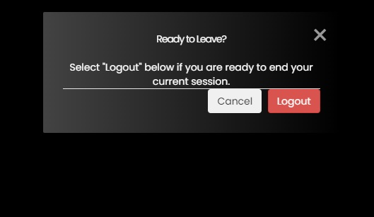
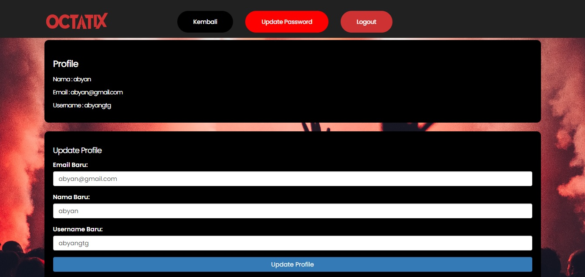
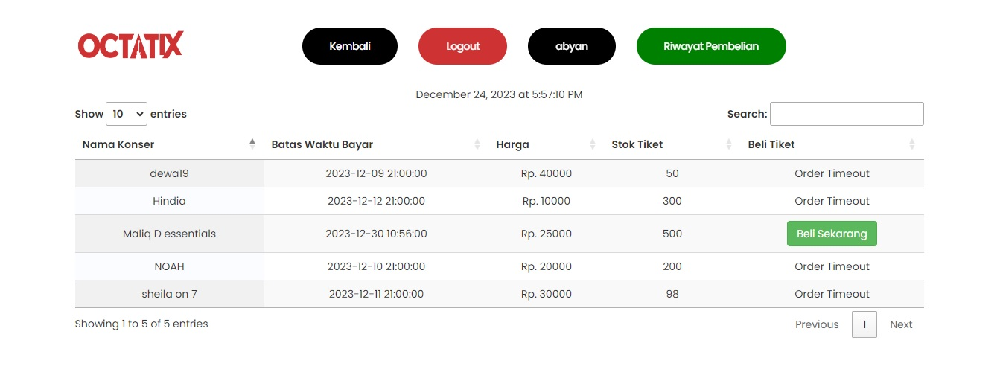
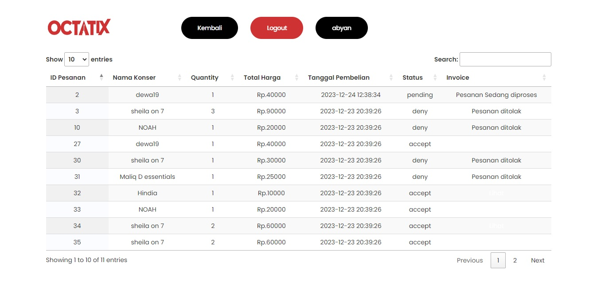

# 
# OCTATIX
<table>
<tr>
<td>
  Established in 2023, OCTATIX aspires to be a pioneer in the global live concert ticket sales sector. Its inception was led by a team of individuals deeply dedicated to music and live performance arts. The primary objective is to offer fans unforgettable experiences and assist artists in promoting their creations.
</td>
</tr>
</table>

## Overview
Here is a working code :  [https://github.com/Naminiges/octatix](https://github.com/Naminiges/octatix)

## Site

### Landing Page
Provide the Contacts Services feature, send message to email.

### Register/Login
Using form validation with Jquery and PHP, forgot password, show/hide password, hashing password, autocomplete, and Level User.
Ocactix also use one username, one account system.
 

### Logout

### Profile
Octatix user can update/delete their account and update password

### Available Tickets
Apply a Searching feature, Pagination, Order Moderation from Admin. User can check the ticket stocks and order deadline. Admin can change the order status like accept, pending, and deny, after the checking the payment receipt. User can't access admin dashboard, it will show the Denied Access/Error page.

### Order History
User can check they order status and invoice, with the print tickets page.

## Responsive Page

## [Usage](https://naminiges.github.io/octatix/) 

### Development
Want to contribute? Great!

To fix a bug or enhance an existing module, follow these steps:

- Fork the repo
- Create a new branch (`git checkout -b improve-feature`)
- Make the appropriate changes in the files
- Add changes to reflect the changes made
- Commit your changes (`git commit -am 'Improve feature'`)
- Push to the branch (`git push origin improve-feature`)
- Create a Pull Request 

### Bug / Feature Request

If you find a bug (the website couldn't handle the query and / or gave undesired results), kindly message an issue to [octatix/issue](https://github.com/Naminiges/octatix/issues) by including your search query and the expected result.

If you'd like to request a new function, feel free to do so by sending an issue at [octatix/issue](https://github.com/Naminiges/octatix/issues). Please include sample queries and their corresponding results.

## Built with 

- [jQuery - Ajax](http://www.w3schools.com/jquery/jquery_ref_ajax.asp) - jQuery simplifies HTML document traversing, event handling, animating, and Ajax interactions for rapid web development.
- [PHP](https://www.w3schools.com/php/) - A Native Programming Language.
- [Bootstrap](http://getbootstrap.com/) - Extensive list of components and  Bundled Javascript plugins.
- [DataTables](https://datatables.net/examples/index) - Extensive list of components and Bundled cdn plugins.

## Team

 |  |  |  | 

[Putera Nami Shiddieqy](https://github.com/naminiges) |[M Abyan Khairi](https://github.com/abyankhairii) |[Jaysha Anbiya Harris](https://github.com/ejaanbiya) |[Aldi Zaki Aulia](https://github.com/aldizakiaulia) |[Ilyas Rafif](https://github.com/iiubric)

[Putera Nami Shiddieqy](https://github.com/naminiges) @ USU

